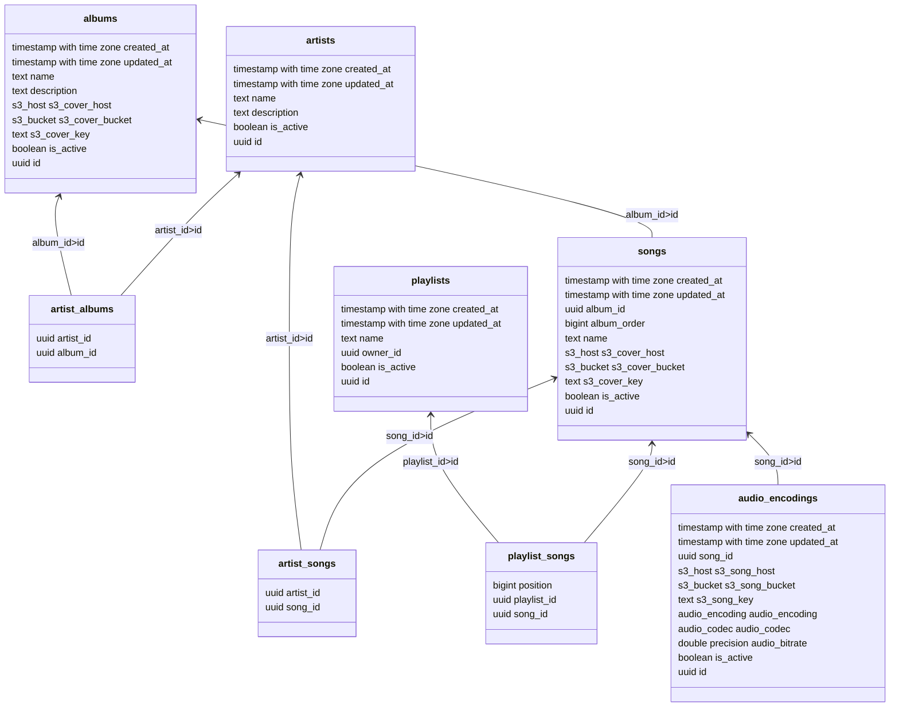

# TORAD API

The TORAD API is based on Hasura. Metadata for Hasura is stored on a Postgres database. Data for TORAD is stored on a
CockroachDB database.

## Tools

- [Install the Hasura CLI](https://hasura.io/docs/latest/hasura-cli/install-hasura-cli/)
- Get something that can bring up `compose.yaml` files (`docker-compose`,  `docker compose`, `podman-compose`)

# Development

## To get a development server running:

1. Bring up the `compose.yaml` file (keep running)
2. `cd hasura`
3. `hasura console` (keep running)

## To create a(n) SQL migration:

1. Make sure the development server is running (`compose.yaml`, `hasura console`)
2. `hasura migrate create <migration-name>`
3. Write queries in newly created `up.sql` and `down.sql`
4. `hasura migrate apply` (applies to running dev server)

# Database Schema

# Container Image

Images are automatically built by Github Actions on each new Git tag push.

`cr.srock.cc/torad/api-config`

The image copies the `hasura/migrations` and `hasura/metadata` to `/mnt`, creating `/mnt/migrations`
and `/mnt/metadata`. Create volume mounts in those locations as appropriate.

It's expected that this container is deployed in the same pod as
a `docker.io/hasura/graphql-engine:<version>.cli-migrations-v3` container as an init container. That way the Hasura
container may mount the same container volumes, allowing it to be configured automatically.